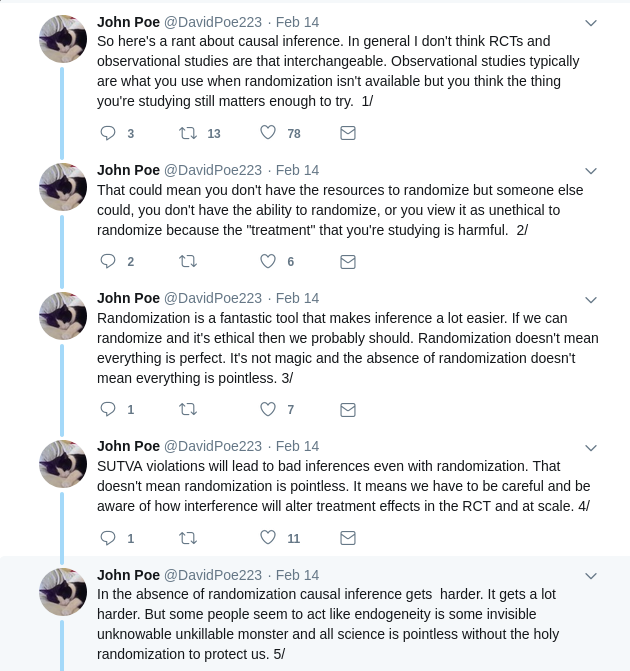
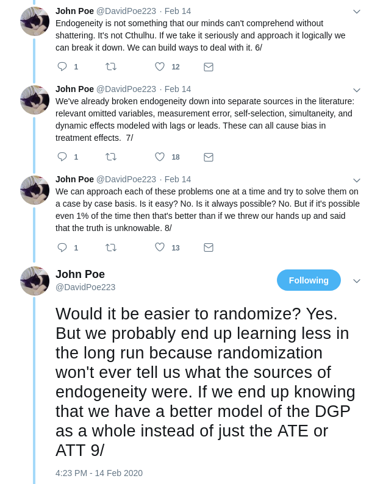
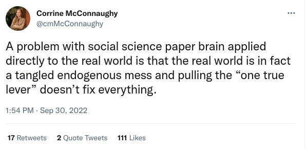
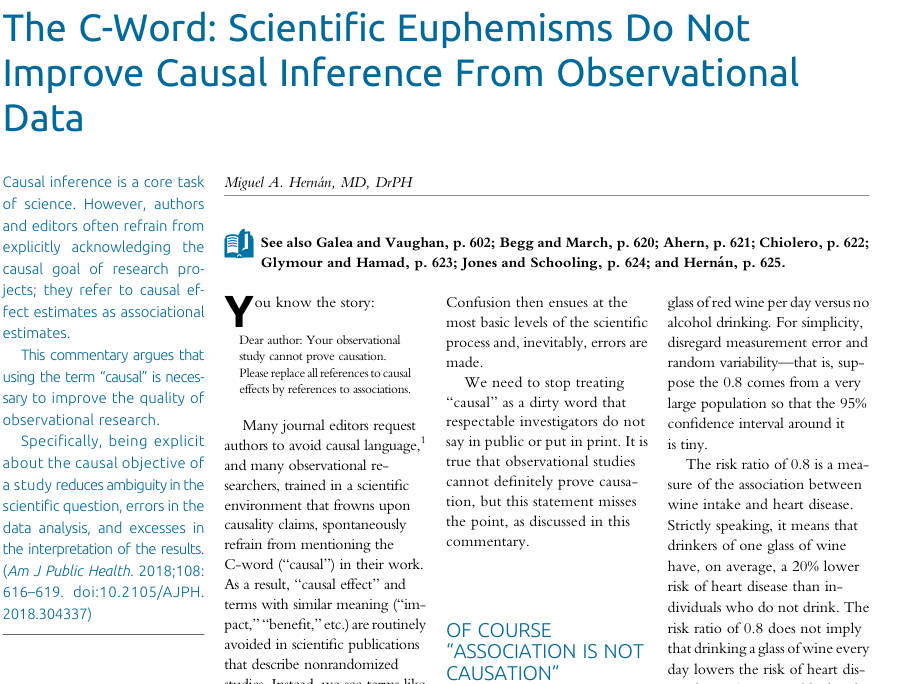
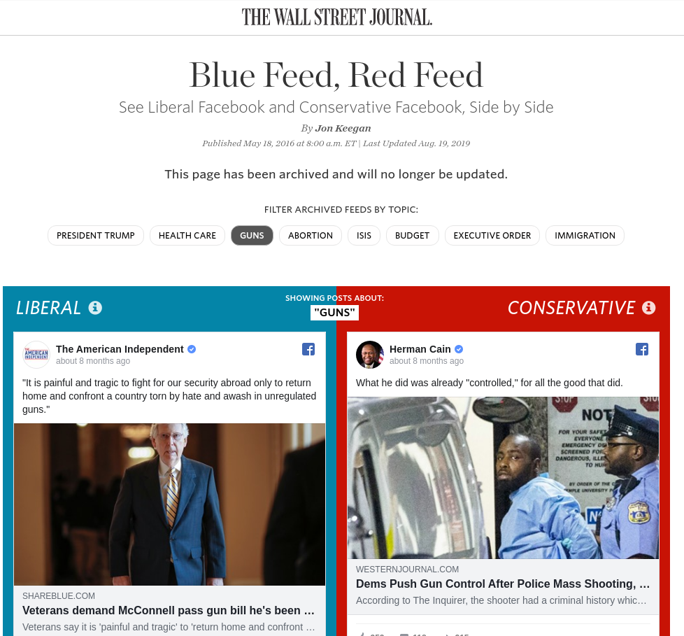
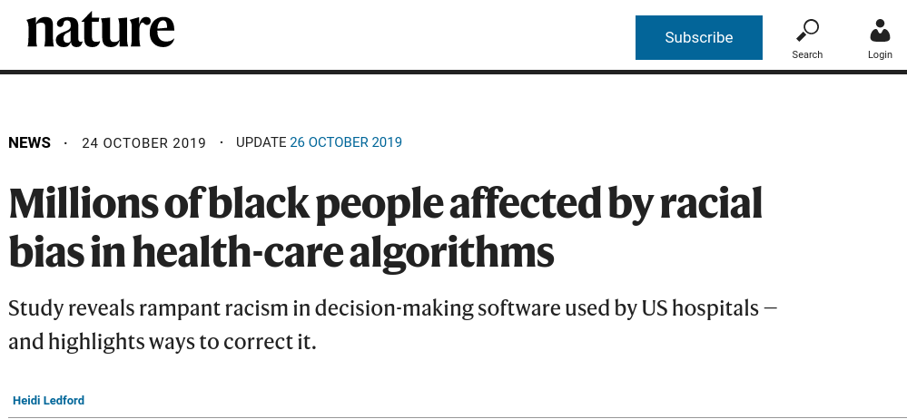
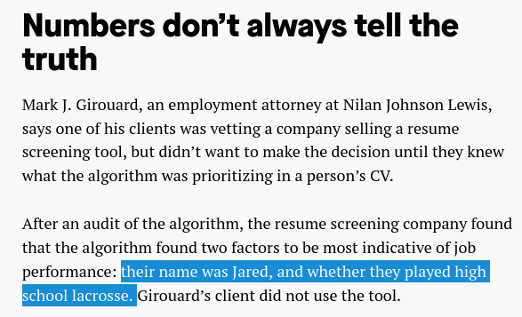
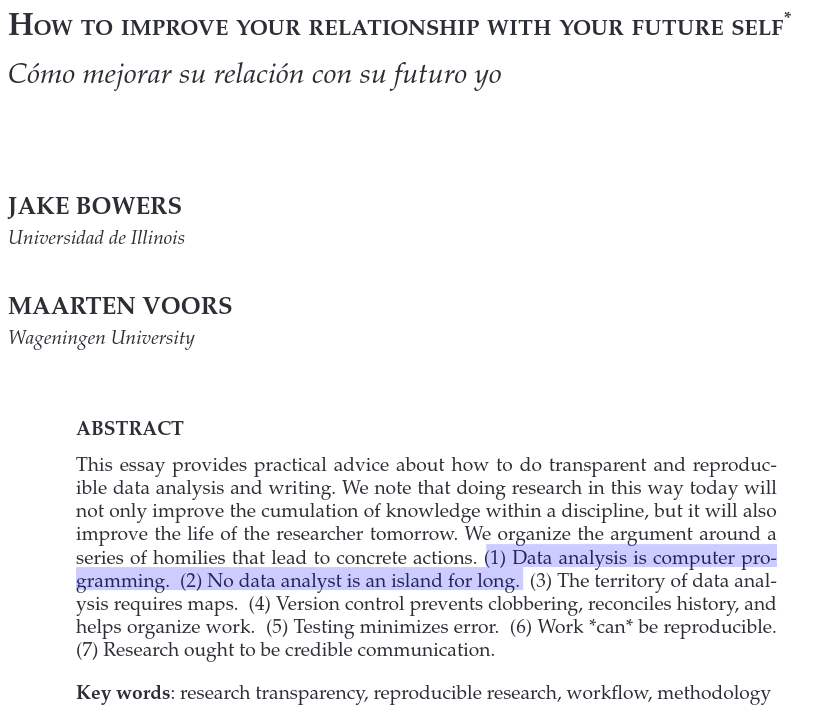

```{r setup, include=FALSE, cache=F, message=F, warning=F, results="hide"}
knitr::opts_chunk$set(cache=TRUE, warning=F, message=F)
knitr::opts_chunk$set(fig.path='figs/',  fig.width=14, fig.height=8.5)
knitr::opts_chunk$set(cache.path='cache/')
knitr::opts_chunk$set(cache.path='cache/',
                      collapse = TRUE, comment = "#>")

knitr::opts_chunk$set(
                  fig.process = function(x) {
                      x2 = sub('-\\d+([.][a-z]+)$', '\\1', x)
                      if (file.rename(x, x2)) x2 else x
                      }
                  )
```

```{r loaddata, echo=F, eval=T, message=F, warning=F}

library(tidyverse)
library(stevemisc)


options("modelsummary_format_numeric_latex" = "plain")
options(knitr.kable.NA = '')
```

# Introduction
### Goal(s) for Today

1. Introduce students to the fundamental problem of causal inference
2. Discuss different research design types and their trade-offs.
3. Talk about issues of research ethics, especially in social science settings.
4. Highlight issues of automation, workflow, and replication.

# Association and Causation
### The Problem, in Quotes

- "That correlation is not causation is perhaps the first thing that must be said." - Barnard, 1982 (p. 387)
- "If statistics cannot relate cause and effect, they add to the rhetoric." - Smith, 1980 (p. 1000 [stylized by me])

### Associational Inference

A set of tools to understand how a response variable corresponds with some attribute. Tools include:

- Probability distributions (conditional, joint)
- Correlation
- Regression

"Associational inference consists of [estimates, tests, posterior distributions, etc.] about the associational parameters relating *Y* and *A* [from units in *U*]. In this sense, associational inference is simply descriptive statistics." - Holland, 1986 (p. 946)

## The Potential Outcomes Framework
### Causal Inference and Rubin's "Potential Outcomes"


### The Problem in a Nutshell

An individual ($i$) who is offered a treatment ($Z_i = 1$) has two potential outcomes:

- An outcome to be revealed if treated ($T_i = 1$): $Y_i(T_i = 1 | Z_i = 1)$
- An outcome to be revealed if *un*treated ($T_i = 0$): $Y_i(T_i = 0 | Z_i = 1)$

This is a missing data problem of a kind.

- We can only observe one.
- No perfect counterfactuals.
- Unicorns don't exist.

### The Solution

For $T_i = 0$ and $T_i = 1$, given both offered treatment ($Z_i = 1$):

$$
\textrm{Individual Treatment Effect for } i  = Y_i(T_i = 1 | Z_i = 1) - Y_i(T_i = 0 | Z_i = 1)
$$

Think in terms of population averages.

- Per Rubin, there is an important population parameter to estimate.
- Hence why he referred to it as "effect of the treatment on the treated." (i.e. TOT)
- Also: the "average treatment effect" (i.e. ATE)


### The Importance of Random Assignment

Per random assignment: participants assigned to treatment/control must be same on average in the population ("equal in expectation").

- i.e. $E[Y_i(T_i = 0 | Z_i = 1)]$ must be equal to $E[Y_i(T_i = 0 | Z_i = 0)]$

By substitution:

$$
TOT = E[Y_i(T_i = 1 | Z_i = 1)] - E[Y_i(T_i = 0 | Z_i = 0)]
$$

When unbiased, a difference in sample means is sufficient:

$$
\hat{TOT} = \frac{\sum_{i=1}^{n_1} Y_i}{n_1} -   \frac{\sum_{i=1}^{n_0} Y_i}{n_0}
$$

## The Important Assumptions of Causal Identification
### Important Assumptions in This Framework

- Exogeneity (worth reiterating)
- Unit homogeneity (i.e. expected *Y*s are same for same values of *X*)
- Conditional independence (i.e. values of *X* are assigned independently of values of *Y*)
- Stable unit treatment value assumption (SUTVA)
    - This one is a bear: think of it as an unmodeled "spillover."
    - Ideally: an observation responds only to its own treatment status.
    
### Examples of SUTVA Violations

1. Contagion (vaccination effects depend on whether others have been vaccinated)
2. Displacement (cap-and-trade moves around emissions; doesn't curtail them)
3. Communication ("hey control group dude, you gotta try this new medication. It rules!")
4. Social comparison ("I like my housing situation less now that I see this group received new public housing")
5. Signaling (governments that advertise policy interventions are no longer "treating" in that sense)
6. Persistence/memory (respondents respond to need to be consistent)


## Observational vs. Experimental Research
### Observational vs. Experimental Research

Observational research: involves a comparison of units subjected to different treatments.

- More common, more flexible. But difficult to isolate causal effects.

Experimental research: units under study are randomly assigned to treatments.

- satisfies key questions about observational research design

### Experiments

Experiments are more effective at addressing causality.

- Want to explain social phenomena like medical researchers testing therapeutic care.
- Satisfies insights from Rubin's potential outcomes framework.
- Researcher control over conditions isolates confounding systematic factors.
- Random assignment isolates systematic differences from random differences.


### Types of Experiments

There are numerous ways of assessing causal effects. One typology:

1. "Between subjects": units randomly assigned to distinct treatment/control groups.
2. "Within subjects": units observed before and after receiving a treatment.


### External vs. Internal Validity 

Internal validity: stimulus faithfully administered, as implemented in the design. Concerns:

- Noncompliance
- Attrition

\bigskip

External validity: results generalizable from the "lab" to the "real world." Concerns:

- Convenience sampling (esp. college students)
- Hawthorne effect

Experiments ideally maximize internal validity, if (possibly) at the expense of external validity.

### Types of Experiments

Experiments are super-flexible. Some types you'll encounter:

1. Lab experiments
    - Maximize internal validity, prioritized over external validity
    - Typically prone to convenience sampling.
2. Survey experiments
    - Balance internal/external validity concerns
    - Typically higher *n* with more representativeness
    - Concerns: spillover, less agency over treatment
3. Field experiment
    - Same pros/cons as survey experiments, but with typically less control over treatment administration.
    - Cons (spillover, treatments) even more pronounced
4. Natural experiment
    - i.e. an exogenous shock to a panel design
5. Quasi-experiment
    - Treatments/controls with no randomization, or control over the treatment.


<!-- ### Criteria for Evaluating Causal Arguments -->

<!-- - Falsifiability; internal consistency (we talked about these) -->
<!-- - Does *X* cause *Y*, or does *Y* cause *X*? -->
<!-- - Is the relationship between *X* and *Y* a covariation (simultaneity)? -->
<!-- - Is the relationship between *X* and *Y* spurious? -->

# A Conversation About Ethics
### Ethics and Replication

*I can't make you do these things in good faith...*

- Social science is rife with cases of academic misconduct.
- Publication incentives breed dishonesty; you are compelled to rise above it.

*...but I can teach you some tools to help you be honest.*

- i.e. this is academic workflow and replication.

## Issues of Ethics
### Some Ethical Takeaways

Your theoretical model is causal. Your empirical model may not be.

- Remember: everything is a "model."

*But don't shirk from using causal language!*

- Absent a causal drive, the aim of the research is directionless/vague.

There's an unnecessary tension between the RCT people and those doing observational analyses.

- Be forthright, but stand your ground.
- Again: your theoretical model is causal. Your empirical model may not be.


###



###



###



###




### Some Ethical Takeaways

The proliferation of machine learning/AI/"algorithms" creates more ethical issues.

1. "Treat", don't manipulate.
2. There's no bias-free model; *you are the bias.*
3. Evil is evil, whether intentional or unintentional.

Don't let stupidity transform into evil.

- Good academic workflow can help.


###



###



###



###


## Replication
### Academic Workflow and Replication

Replication crises/academic misconduct are proliferating in social science. Examples:

- Economics: Reinhart and Rogoff's (2010) Excel error
    - *ed. their analysis was **way** more dishonest than the Excel error, but that got the most attention.*
    - See: ["Revisiting Reinhart and Rogoff, Ten Years Later"](http://svmiller.com/blog/2020/04/reinhart-rogoff-ten-years-later-replication/) on my website.
- Psychology: too many to list
    - Recurring themes: small-*n*, *p*-hacked experiments, or even fabricated data
- Sociology/criminology: Stewart retractions
- Political science: Lacour and Green (2014) scandal

I'm not going to assign motives (naiveté or something worse) to all these scandals and those involved.

- But, assuming honesty, you can avoid a similar pitfall with good workflow.

### Some Tips on Good Workflow/Replication

"Kondo" your projects into sub-directories.

- Keep things tidy/de-cluttered in your project.
- I have my recommendations, but tweak for what works for you.

"Launder" your data; never overwrite them.

- Never overwrite original columns. Recode into new columns/objects.
- *Definitely* never overwrite raw data. 

Related: invest in cloud storage (e.g. Box, Dropbox).

- Create separate folders for raw data (`data`) and your individual projects (`projects`).
- Tongue in cheek: think of "my laptop broke/fried/got stolen" as the 21st century equivalent of "the dog ate my homework."

*Learn to automate what you can.*

### An Example of Sub-Directories


### Surprise! You're a Computer Programmer Now



### An Example of Automating/Reproducing a Workflow


# Conclusion
### Conclusion

It was good to talk with you over the semester on these issues. Takeaways for today:

- Causality is exact (and yet multiple). Understand what's at stake.
- Each (obs. or exp.) research design has its own set of trade-offs.
- The whole world's an endogenous mess, but we're all trying.
- I can't make you be honest, but I can give you tips/tools to help.
- Accidental evil is still evil. Don't be evil.