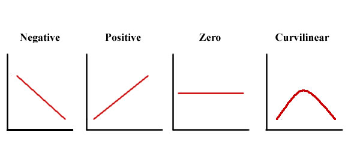
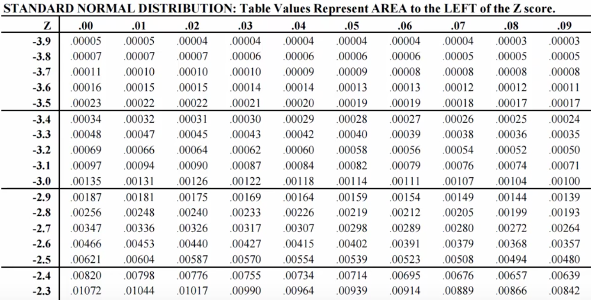
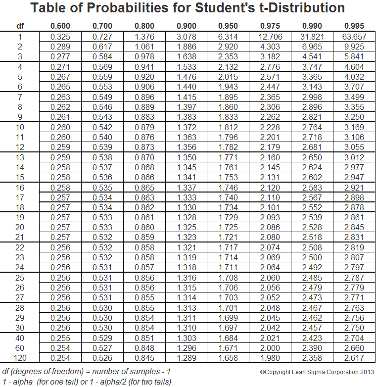

```{r setup, include=FALSE, cache=F, message=F, warning=F, results="hide"}
knitr::opts_chunk$set(cache=TRUE, warning=F, message=F, echo=FALSE, fig.width = 14, fig.height = 8.5)
knitr::opts_chunk$set(fig.path='figs/')
knitr::opts_chunk$set(cache.path='cache/',
                      collapse = TRUE, comment = "#>")

knitr::opts_chunk$set(
                  fig.process = function(x) {
                      x2 = sub('-\\d+([.][a-z]+)$', '\\1', x)
                      if (file.rename(x, x2)) x2 else x
                      }
                  )
```


```{r loadstuff, include=FALSE}
knitr::opts_chunk$set(cache=TRUE)
options(knitr.kable.NA = '')
library(tidyverse)
library(stevemisc)
library(stevedata)
# library(peacesciencer)
# library(fixest)
library(kableExtra)
# library(modelsummary)
library(patchwork)
library(cowplot); #library(artyfarty)
library(dqrng)

options("modelsummary_format_numeric_latex" = "plain")
options(knitr.kable.NA = '')
```

```{r loaddata, cache=F, eval=T, echo=F, message=F, error=F, warning=F}


Population <- rbnorm(250000, mean =42.42, sd = 38.84,
                     lowerbound = 0, 
                     upperbound = 100,
                     round = TRUE,
                     seed = 8675309) # Jenny, I got your number...

set.seed(8675309) # Jenny, I got your number...
# Note {dqrng} offers much faster sampling at scale
# This is the dqsample() function
Popsamples <- tibble(
  samplemean=sapply(1:1000000,
           function(i){ x <- mean(
             dqsample(Population, 10,
                    replace = FALSE))
           }))
```


# Introduction
### Goal(s) for Today

1. Revisit the logic of (infinity) random sampling from a knonw population.
2. Introduce students to the so-called "confidence" interval.
3. Reiterate what sample inference to a population actually is.

# Hypothesis Testing
## A Brief Aside
### A Brief Aside

Today is going to be "hypothesis testing" vis-a-vis a sample and the population.

- i.e. what is the probability of the sample statistic, given the population parameter?

What it's not, but you should know anyway: framing hypotheses from your theories.

### What is a Hypothesis (by Way of Theory)?

Hypotheses are testable statements about a relationship between an independent variable and a dependent variable.

- Dependent variable: the thing you want to explain.
- Independent variable: the thing you believe explains variation in the dependent variable.

### What Should Hypotheses Say?

Hypotheses must communicate the following:

1. A clear identification of proposed cause and effect
2. The proposed relationship expected between both variables
3. The unit of analysis
4. An unambiguous indication of the type of measurement in both variables.


### Types of Proposed Relationships



## Revisiting What We Did Last Time
### Making Guesses About the Population

Let's revisit the previous case we used (inspired by American attitudes re: Trump).

- We have a hypothetical politician who is more despised than revered.
- Population (n = 250,000) is evaluating the politician with a thermometer rating [0:100]
- We, the gods creating Population, assign known population parameters.

We want to make guesses about Population based on samples of Population.

### Creating the Data

Let's revisit the data we created.

```r
# rbnorm() from {stevemisc}
Population <- rbnorm(250000, mean = 42.42, sd = 38.84,
                     lowerbound = 0, 
                     upperbound = 100,
                     round = TRUE,
                     seed = 8675309) # Jenny, I got your number...
```

And the summary statistics.

```{r, eval=T, echo=T}
mean(Population)
sd(Population)
# ^ these are the gospel truth about Population
```

### Central Limit Theorem

**Central limit theorem** says:

- with an infinite number samples of size *n*...
- from a population of *N* units...
- the sample means will be normally distributed.

Corollary findings:

- The mean of sample means would equal $\mu$.
- Random sampling error would equal the standard error of the sample mean ($\frac{\sigma}{\sqrt{n}}$).

### R Code

```{r sampmil, echo=T, eval=F, cache=TRUE}
set.seed(8675309) # Jenny, I got your number...
# Note {dqrng} offers much faster sampling at scale
# This is the dqsample() function
Popsamples <- tibble(
  samplemean=sapply(1:1000000,
           function(i){ x <- mean(
             dqsample(Population, 10,
                    replace = FALSE))
           }))
```


 
###

```{r plotsampmil, echo=F, eval=T, fig.width=14, fig.height=8.5}
Popsamples %>%
  ggplot(.,aes(samplemean)) + 
  geom_density(fill="#619cff", alpha=.7, color="#619cff") +
  # geom_histogram(binwidth=.5,aes(y=..density..),alpha=0.7) +
  theme_steve_web() + 
  geom_vline(xintercept = mean(Population), linetype="dashed") +
  stat_function(fun=dnorm,
                color="#002F5F", size=1.5,
                args=list(mean=mean(Popsamples$samplemean), 
                          sd=sd(Popsamples$samplemean))) +
  scale_x_continuous(breaks = seq(0, 100, by=10)) +
  labs(x = "Sample Mean", y = "Density",
       title = "The Distribution of 1,000,000 Sample Means, Each of Size 10",
       subtitle = "Notice the distribution is normal and the mean of sample means converges on the known population mean (vertical line).",
       caption = "Data: Simulated data for a population of 250,000 where mean = 42.42 and standard deviation = 38.84.")

```

## Standardizing a Sampling Distribution
### Standardization

A raw normal distribution I presented is somewhat uninformative.

- **Standardization** will make it useful.

\begin{equation}
    z = \frac{\textrm{Deviation from the mean}}{\textrm{Standard unit}}
\end{equation}

The standard unit will vary, contingent on what you want.

- If you're working with just one random sample, it's the standard deviation.
- If you're comparing sample means across multiple random samples, it's the standard error.


### Standardization

Larger *z* values indicate greater difference from the mean.

- When *z* = 0, there is no deviation from the mean (obviously).

Standardization allows for a better summary of a normal distribution.

###


```{r ggplotshade, echo=F, eval=T, fig.width=14, fig.height=8.5}
normal_dist("#002F5F","#002F5F", "Open Sans") + 
  theme_steve_web() +
  # ^ all from stevemisc
    labs(title = "The Area Underneath a Normal Distribution",
       subtitle = "The tails extend to infinity and are asymptote to zero, but the full domain sums to 1. 95% of all possible values are within about 1.96 standard units from the mean.",
       y = "Density",
       x = "")
```

###

```{r plotsampmilz, echo=F, eval=T,  fig.width=14, fig.height=8.5}
Popsamples %>%
  mutate(z = (samplemean-mean(samplemean))/sd(samplemean)) %>%
  # ggplot(.,aes(z)) +  
  # stat_dots() +
  # stat_function(fun=dnorm,
  #               color="#002F5F", size=1.5)
  ggplot(.,aes(z)) + 
  geom_density(fill="#619cff", alpha=.7, color="#619cff") +
  #  geom_histogram(binwidth=.1,aes(y=..density..),alpha=0.7) +
  theme_steve_web() + 
  geom_vline(xintercept = 0, linetype="dashed") +
  scale_x_continuous(breaks = c(-4:4)) +
  stat_function(fun=dnorm,
                color="#002F5F", size=1.5) +
  labs(x = "Sample Mean (Standardized)", y = "Density",
       title = "The Distribution of 1,000,000 Sample Means, Each of Size 10",
       subtitle = "Notice the distribution is normal and the mean of sample means converges on the known population mean (vertical line).",
       caption = "Data: Simulated data for a population of 250,000 where mean = 42.42 and standard deviation = 38.84.")
```

## Inference Using the Normal Distribution
### Inference Using the Normal Distribution

What's the next step? Assume this scenario for illustration.

- We as researchers have a sample of 100 people from this population.

```{r oursample, cache=T, eval=T, echo=T}
set.seed(8675309)
oursample <- sample(Population, 100, replace = FALSE)
mean(oursample)
```

- We as researchers don't know $\mu$ (though it's `r round(mean(Population), 2)`).
- We assume we know $\sigma$ (`r round(sd(Population), 2)`), a bit unrealistic, but alas...
- We have an *n* of 100 and $\overline{x}$ of `r round(mean(oursample), 2)`.

We want to make a statement about the location of the population mean.


### Inference Using the Normal Distribution

Our best guess of the population parameter from the sample is the sample statistic.

- We have to account for the noise introduced by random sampling.
- However, we'll never truly "know" the population parameter.

A **95-percent confidence interval** can be informative.

- It's the interval in which 95% of all possible sample estimates will fall by chance.
- We operationalize this as $\overline{x} \pm (1.96)$*(standard error).

### Inference Using the Normal Distribution

How we apply this for our problem.

- We have our $\overline{x}$.
- We have our *n* and assume a known $\sigma$.
- Standard error = `r round(sd(Population)/sqrt(length(oursample)), 3)` ($\frac{\sigma}{\sqrt{n}} = \frac{38.88}{\sqrt{100}} = 3.88$)

### Inference Using the Normal Distribution

We can get our upper/lower bounds of a 95-percent confidence interval.

\begin{equation}
\textrm{Lower bound} =  \overline{x} - (1.96)*(s.e.)
\end{equation}


\begin{equation}
\textrm{Upper bound} =  \overline{x} + (1.96)*(s.e.)
\end{equation}

### A Brief Aside...

If we're going to do inference the wrong way, we should at least get the *z*-values right.

```{r, echo=T}
# p_z() is in {stevemisc}

p_z(.32) # this is not 1
p_z(.10) # this is not 1.645
p_z(.05) # this is not 1.96
p_z(.01) # this is not 2.58
p_z(0) # okay, that's still infinity
```

### R Code

```{r, echo=T}
#computation of the standard error of the mean
sem <- sd(Population)/sqrt(length(oursample))
#95% confidence intervals of the mean
c(mean(oursample) - 1.96*sem, mean(oursample) + 1.96*sem)
```

### Inference Using the Normal Distribution

We discuss this interval as follows.

- If we took 100 samples of *n* = 100, 95 of those random samples on average would have sample means between `r round(mean(oursample)-1.96*sem, 2)` and `r round(mean(oursample)+1.96*sem, 2)`.

We're not saying, for the moment, the true population mean is between those two values. We don't necessarily know that.

- However, even this process gives us some nice properties.

## An Illustraiton of Inference
### An Illustration of Inference

Assume we have a politician's supporter who is suspicious of our $\overline{x}$.

- They claims it has to be much higher. Say: 56.61.
    - Rationale: this is the percentage of the vote Trump in the precinct where I lived during the 2020 election.
    - In other words, they are basically inferring by anecdote or making hasty generalizations from his/her surroundings.

So what can we do about this claim?

### An Illustration of Inference

This is a probabilistic question!

- i.e. What was the probability of $\overline{x}$ = `r round(mean(oursample), 2)` if $\mu$ = 56.61?

We can answer this by reference to *z* values.

\begin{equation}
z = \frac{\overline{x} - \mu}{s.e.}
\end{equation}

### R Code

```{r getourz, echo=T}
(mean(oursample) - 56.61)/sem
```


### Find the *z* Value



### ...or in R

\scriptsize

```{r orinr, echo=T}
# one-tailed (i.e. I'm assuming the direction)
pnorm(abs((mean(oursample) - 56.61)/sem), lower.tail=FALSE)
# two-tailed (i.e. I don't know the direction)
# Notice there really isn't much happening in this distinction
# "two-tail" is a sort of default, but it's kind of silly that it is.
2*pnorm(abs((mean(oursample) - 56.61)/sem), lower.tail=FALSE)
```


\normalsize

### An Illustration of Inference

What is the probability that a random sample would produce a *z* value of `r round((mean(oursample)-56.61)/sem, 4)`?

- Answer: `r sprintf("%.5f",round(1-pnorm(abs((mean(oursample)-56.61)/sem)), 5))`

In other words: if $\mu$ were 56.61, we'd observe that $\overline{x}$ only about `r round((1-pnorm(abs((mean(oursample)-56.61)/sem)))*10000, 0)` times in 10,000 trials, on average.

- This is highly improbable.

### An Illustration of Inference

What do we conclude?

- We suggest this hypothetical supporter is likely wrong in their assertion.
- We offer that our sample mean is closer to what $\mu$ really is.

Since we've been playing god this whole time, we incidentally know that's true.

- However, this procedure doesn't necessarily tell you what $\mu$ is.
- It's communicating what you think it's highly unlikely to be.

### What About the Known Population Mean?

How likely was our $\overline{x}$ of `r round(mean(oursample), 2)` given the $\mu$ of `r round(mean(Population), 2)`? Same process.

\scriptsize

```{r sameprocess, echo=T}
(mean(oursample) - mean(Population))/sem
# One tail (i.e. I'm assuming the direction)
pnorm(abs((mean(oursample) - mean(Population))/sem), 
        lower.tail=FALSE)
# Two tail (i.e. I'm agnostic about the direction)
2*pnorm(abs((mean(oursample) - mean(Population))/sem), 
        lower.tail=FALSE)
```

\normalsize

The probability of our sample mean, given the population mean (that we know), is `r round(1-pnorm(abs((mean(oursample)-mean(Population))/sem)), 2)`.

- This is a likely outcome.
- We cannot rule out the population mean from our random sample like we could with the hypothetical mean of 56.61.

### Some Derivations

We assumed we knew $\sigma$, if not $\mu$. What if we don't know either?

- Use the sample standard deviation (*s*) instead.
- Do the same process with a **Student's t-distribution**.
- This is almost identical to a normal distribution, but with fatter tails for fewer **degrees of freedom**.
    - Degrees of freedom = n - k (i.e. number of observations - number of parameters [here: 1])

Uncertainty increases with fewer degrees of freedom.

### Student's t-distribution



### ...or in R

\scriptsize

```{r, echo=T, eval=T}
# proposed mean
(mean(oursample) - 56.61)/(sd(oursample)/
                             sqrt(100))  -> tstat1 
 # actual mean
(mean(oursample) - mean(Population))/(sd(oursample)/
                                        sqrt(100)) -> tstat2

# probability of what we got, if the politician's supporter is right
pt(-abs(tstat1), df = 100-1) # one tail
2*pt(-abs(tstat1), df = 100-1) # two tail
# probability of what we got, knowing what the population mean is
pt(-abs(tstat2), df = 100-1) # one tail
2*pt(-abs(tstat2), df = 100-1) # two tail
```

\normalsize

# Conclusion: What Are We Actually Doing?
### Conclusion: The Process of Inference

Notice the process of inference.

1. Assume the hypothetical mean to be correct (as a hypothesis, if you will).
2. Test the claim about the hypothetical mean based on a random sample.
3. Infer about the claim of the population mean using probabilistic inference.

Does that look familiar? It's $p(\bar{x} | \mu)$.

- Notice what it's *not*? $p(\mu | \bar{x})$.
- That's not the question you're asking but it's the answer you're getting.

### Conclusion: The Process of Inference

*We will never know $\mu$.*

- But this process gives an indirect answer to the question you're asking.
- *Within* a desired confidence interval: "I can't rule these out."
- *Outside* a desired confidence interval: "what I got is highly unlikely if what you're proposing were actually true."

Still: you'll learn more about what $\mu$ can be by assessing what it's highly unlikely to be.