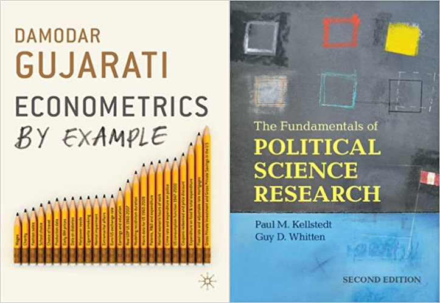
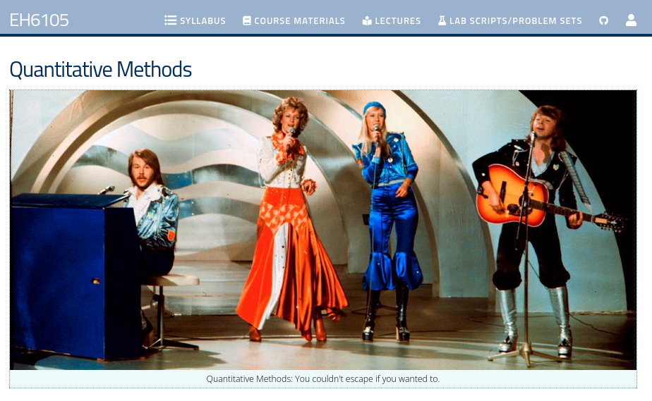
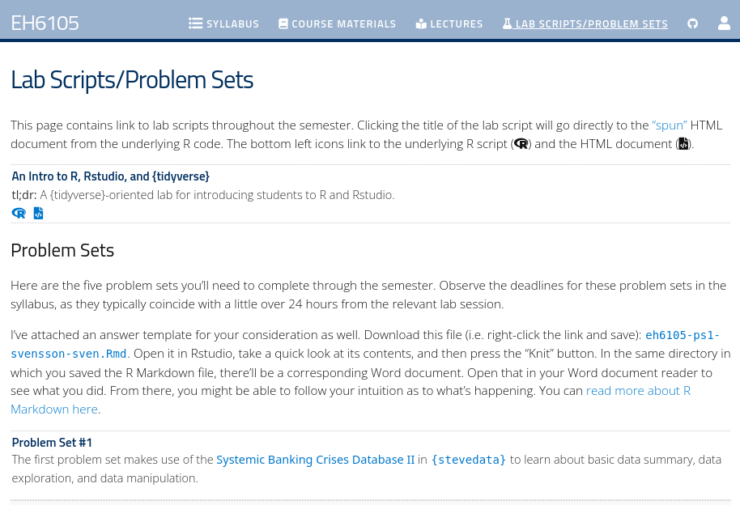
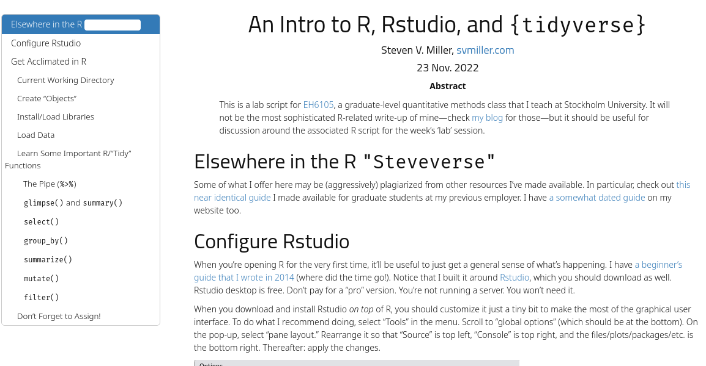
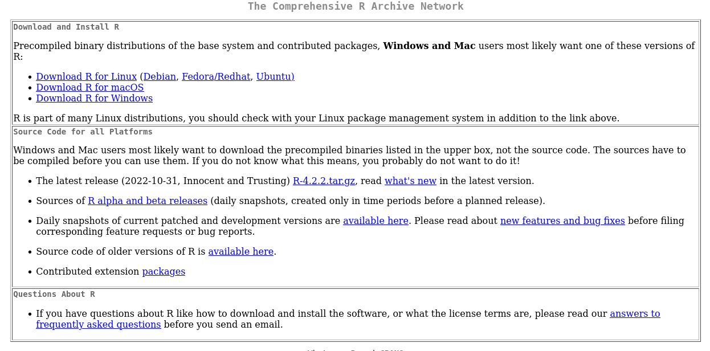
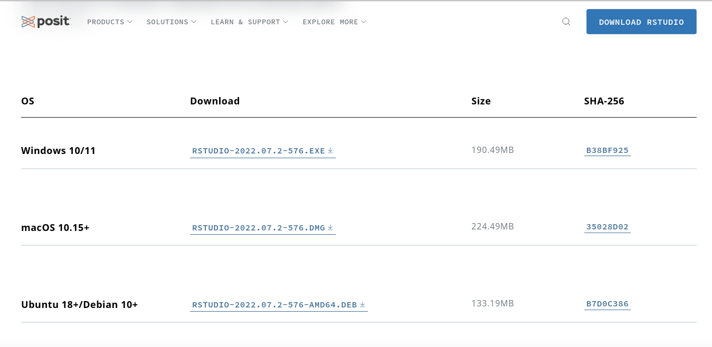

```{r setup, include=FALSE, cache=F, message=F, warning=F, results="hide"}
knitr::opts_chunk$set(cache=TRUE, warning=F, message=F, echo=FALSE, fig.width = 14, fig.height = 8.5)
knitr::opts_chunk$set(fig.path='figs/')
knitr::opts_chunk$set(cache.path='cache/')

knitr::opts_chunk$set(
                  fig.process = function(x) {
                      x2 = sub('-\\d+([.][a-z]+)$', '\\1', x)
                      if (file.rename(x, x2)) x2 else x
                      }
                  )
```


```{r loadstuff, include=FALSE}
knitr::opts_chunk$set(cache=TRUE)
options(knitr.kable.NA = '')
library(tidyverse)
library(stevemisc)
# library(peacesciencer)
# library(fixest)
library(kableExtra)
# library(modelsummary)
library(patchwork)
library(cowplot); #library(artyfarty)

options("modelsummary_format_numeric_latex" = "plain")
options(knitr.kable.NA = '')
```

```{r loaddata, cache=F, eval=T, echo=F, message=F, error=F, warning=F}
library(lubridate)
mon <- ymd(20221128)
semester_dates <- seq(ymd(20221201), ymd(20230109), by=1)
seminar_dates <- c(ymd(20221201), ymd(20221202),
                   ymd(20221205), ymd(20221208),
                   ymd(20221212), ymd(20221212),
                   ymd(20221214), ymd(20221220),
                   ymd(20230102), ymd(20230109))
lab_dates <- c(ymd(20221206), ymd(20221209),
               ymd(20221220), ymd(20221222),
               ymd(20230104))
problem_set_dates <- c(ymd(20221207),
                       ymd(20221213),
                       ymd(20221221),
                       ymd(20221223),
                       ymd(20230105))


tibble(date = seq(ymd(20221201), ymd(20230131), by=1)) %>%
  mutate(mon = lubridate::month(date, label=T, abbr=F), # get month label
         mon = fct_relevel(mon, "November", "December", "January"),
         wkdy = weekdays(date, abbreviate=T), # get weekday label
         wkdy = fct_relevel(wkdy, "Sun", "Mon", "Tue", "Wed", "Thu","Fri","Sat"), # make sure Sunday comes first
         week = wom(date),
         semester = ifelse(date %in% semester_dates, 1, 0),
         lab = ifelse(date %in% lab_dates, 1, 0),
         day = lubridate::mday(date), # get day of month to add later as a label,
         seminar = ifelse(date %in% seminar_dates, 1, 0),
         category = case_when(
           #date %in% semester_dates ~ "Semester",
           date %in% seminar_dates ~ "Seminar",
           date %in% lab_dates ~ "Lab",
           date %in% problem_set_dates ~ "Problem Set Due",
           TRUE ~ "NA",
         ),
         category = ifelse(date == ymd(20221220), "Seminar/Lab", category),
         category = ifelse(date == ymd(20230113), "Final Exam Due", category)) %>%
  ggplot(.,aes(wkdy, week)) +
  # custom theme stuff below
  # theme_steve_web() +
  theme_steve_web() +
  theme(panel.grid.major.x = element_blank()) +
  # geom_tile and facet_wrap will do all the heavy lifting
  geom_tile(alpha=0.8, aes(fill=category), color="black", size=.45) +
  facet_wrap(~mon, scales="free", ncol=3) +
  # fill in tiles to make it look more "calendary" (sic)
  geom_text(aes(label=day),family="Open Sans") +
  # put your y-axis down, flip it, and reverse it
  scale_y_reverse(breaks=NULL) +
  scale_fill_manual(values=c("Seminar"="#dfc27d",
                             "Lab"="#bf812d",
                             "Seminar/Lab"="#8c510a",
                             "Problem Set Due" = "#80cdc1",
                             "Final Exam Due" = "#01665e",
                             "NA" = "white" # I like these whited out...
                             ),
                    breaks=c("Seminar","Lab", "Seminar/Lab", "Problem Set Due", "Final Exam Due")) +
  labs(x = "", y = "",fill="",
       caption = "All problem sets (and the final exam) are due *before* 8 p.m. on that corresponding day.\nDo note that Dec. 20 is both a seminar and lab day. Check the syllabus and TimeEdit for more.") -> class_cal
```

# Introduction
### Goal(s) for Today

1. Introduce students to the basic structure of the course.
2. Get students to download and install R, Rstudio, and some required libraries.


# Structure of the Course
### Course Objectives

1. Read and critically evaluate research in economic history and international relations where quantitative methods are used.
1. Formulate statistical models and test hypotheses
2. Solve basic problems by reference to probability theory, correlation analysis, and regression.
3. Use statistical software and present results from analyses of source material.
4. Demonstrate an awareness of ethical aspects of research.

### Books



## Grading Stuff
### Grading Policy

There are a total of 100 points to be allocated this semester.

- Five problem sets (8*5 = 40 points)
- Final exam (60 points)

### Grade Distribution

```{r, echo=F, results="asis"}
library(kableExtra)

tribble(~grade, ~points, ~summary,
        "F", "0-39", "FAIL",
        "Fx*", "40-49", "INSUFFICIENT", 
        "E", "50-59", "ADEQUATE",
        "D", "60-69", "SATISFACTORY", 
        "C", "70-79", "GOOD", 
        "B", "80-89", "VERY GOOD", 
        "A", "90-100", "EXCELLENT",
) %>% kbl(.,
      align = "ccc",
      longtable = T, booktabs = T, linesep = '',
      caption = "A Summary of the Grading Outcomes for the Semester",
      col.names = c("Grade", "Point Range", "Summary")) %>%
  kable_styling(latex_options = "striped", stripe_color = "gray!20") %>%
  #column_spec(4, width = "24em") %>%
 # footnote(symbol = "A complementary assignment given by the examiner must be handed in within a week to get the grade E.") %>%
  kable_styling(latex_options = c("repeat_header")) %>%
  row_spec(0, bold=TRUE)
```

## Lab Stuff
### Lectures and Computer Labs

This class has nine lectures (seminars) and five computer labs.

- Attendance in lecture is assumed but not required.
- *Attendance in labs is mandatory.*

Missed lab policy:

- If you miss one lab, you'll have to do a make-up assignment at my discretion (in addition to the homework).
- If you miss two labs, you cannot complete the course.

### Other Lab Policies

There are two lab "groups" (A, B).

- Self-select into groups, though A will ideally go at a gentler pace than B (check Athena).
- *Let me know which one works best for you*.
- For attendance: it's a case of "six of one." 
    - Just make sure you attend at least one of the two sessions that day.

All labs will be done in R and Rstudio.

- There is no way around this.
- We have the computer labs (E 347), but it's best to use your laptop.

### Class Calendar

```{r}
class_cal
```

## A Tour of the Course Website (`eh1605.svmiller.com`)
### Course Website (`eh1605.svmiller.com`)




### Lab Scripts and Problem Sets (`eh1605.svmiller.com`)




### First Lab Script (`eh1605.svmiller.com`)



# Download R and Rstudio
### Download R (`cran.r-project.org`)




### A Few Comments on Installing R

For Windows users:

- You'll also need to install Rtools (which you can get from the same place).

For Mac users:

- Be mindful of your Mac OS X system version.
- You *may* need to install XQuartz or upgrade Xcode for package installation.

For Linux users:

- You're going to get poked to install some development libraries.

For Chromebook/tablet users:

- You'll have to use the computer lab. There's no way around this.

*I'll assume silence on any issues with R means the absence of any problem.*

### Download Rstudio (`posit.co`)



Note: download the free version. Don't ever pay for anything related to R.

### Install These R Packages

\small
```{r, eval=F, echo=T}
install.packages("tidyverse")      # for most things workflow
# ^ This is a huge installation. It should take a while.
install.packages("peacesciencer")  # some peace science data
install.packages("stevedata")      # for toy data sets to use in-class
install.packages("stevemisc")      # for some helper functions
install.packages("stevetemplates") # for preparing reports
install.packages("lmtest")         # for model diagnostics
```

\normalsize

Note: you'll only need to install a package once, but you'll need to load it every session.

# Conclusion
### Conclusion

Welcome to the semester!

- Read the syllabus.
- Get acclimated with the course website (`eh6105.svmiller.com`)
- Check out Athena (where you'll submit assignments).

*Install R and Rstudio*.
